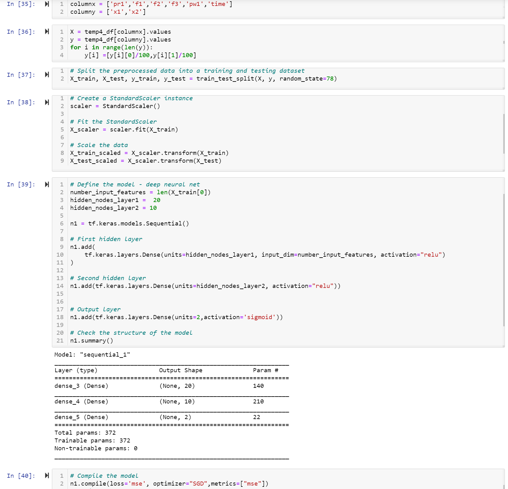

# ReactorModel

A. Topic

Model for Consistent Process Control

B. Why

The Process Control cannot be easily modelled using conventional methods.
Looking at machine learning concepts to solve this / partially answer the 
difficult problem

C. Data

1. Data will be generated on proprietary machine and uploaded to postgres.
2. Data includes all input/output parameters including machine ID.

D. Expected Results

1. To predict input parameter to control the behavior of the process
to produce certain predictable/consistent outcomes needed in manufacturing

E. Logistics

1. Solo Project : Lakshmanan Karuppiah
2. Data : Real Machine Data (multiples)
3. Initial data was loaded into Postgres and read using sqlalchemy create_engine
4. Multiple data generated from various machine will be merged in postgres
5. sep30.ipynb is the jupyter notebook file with data extraction,transformation, 
and machine model
6. Google slide link is  the inital presentation  and will be expanded as the 
project progresses
7. the picturs are snipits of the jupyter notebook to show the data loading /extraction 
,cleaning and machine model coded in  jupyter notebook

E. PRESENTATION (Google Slides Link)

